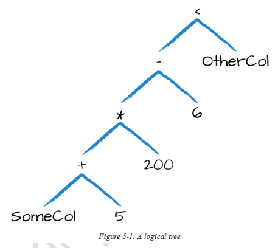

# Chapter 5：基本结构化API操作

## Schemas

我这里使用的是书附带的数据源中的 `2015-summary.csv` 数据
```scala
scala> val df = spark.read.format("csv").option("header","true").option("inferSchema","true").load("data/2015-summary.csv")
df: org.apache.spark.sql.DataFrame = [DEST_COUNTRY_NAME: string, ORIGIN_COUNTRY_NAME: string ... 1 more field]

scala> df.printSchema
root
 |-- DEST_COUNTRY_NAME: string (nullable = true)
 |-- ORIGIN_COUNTRY_NAME: string (nullable = true)
 |-- count: integer (nullable = true)
```
通过printSchema方法打印df的Schema。这里Schema的构造有两种方式，一是像上面一样读取数据时根据数据类型推断出Schema（schema-on-read），二是自定义Schema。具体选哪种要看你实际应用场景，如果你不知道输入数据的格式，那就采用自推断的。相反，如果知道或者在ETL清洗数据时就应该自定义Schema，因为Schema推断会根据读入数据格式的改变而改变。

看下Schema具体是什么，如下输出可知自定义Schema要定义包含StructType和StructField两种类型的字段，每个字段又包含字段名、类型、是否为null或缺失
```scala
scala> spark.read.format("csv").load("data/2015-summary.csv").schema
res1: org.apache.spark.sql.types.StructType = StructType(StructField(DEST_COUNTRY_NAME,StringType,true), StructField(ORIGIN_COUNTRY_NAME,StringType,true), StructField(count,IntegerType,true))
```

一个自定义Schema的例子，具体就是先引入相关类`StructType`,`StructField`和相应内置数据类型（Chapter 4中提及的Spark Type），然后定义自己的Schema，最后就是读入数据是通过schema方法指定自己定义的Schema
```scala
scala> import org.apache.spark.sql.types.{StructType,StructField,StringType,LongType}
import org.apache.spark.sql.types.{StructType, StructField, StringType, LongType}

scala> val mySchema = StructType(Array(
     |  StructField("DEST_COUNTRY_NAME",StringType,true),
     |  StructField("ORIGIN_COUNTRY_NAME",StringType,true),
     |  StructField("count",LongType,true)
     | ))
mySchema: org.apache.spark.sql.types.StructType = StructType(StructField(DEST_COUNTRY_NAME,StringType,true), StructField(ORIGIN_COUNTRY_NAME,StringType,true), StructField(count,LongType,true))

scala> val df = spark.read.format("csv").schema(mySchema).load("data/2015-summary.csv")
df: org.apache.spark.sql.DataFrame = [DEST_COUNTRY_NAME: string, ORIGIN_COUNTRY_NAME: string ... 1 more field]

scala> df.printSchema
root
 |-- DEST_COUNTRY_NAME: string (nullable = true)
 |-- ORIGIN_COUNTRY_NAME: string (nullable = true)
 |-- count: long (nullable = true)
```

看这里StringType、LongType，其实就是Chapter 4中谈过的Spark Type。还有就是上面自定义Schema真正用来的是把RDD转换为DataFrame，[参见之前的笔记](https://github.com/josonle/Learning-Spark/blob/master/notes/LearningSpark(8)RDD%E5%A6%82%E4%BD%95%E8%BD%AC%E5%8C%96%E4%B8%BADataFrame.md#%E6%96%B9%E6%B3%95%E4%BA%8C%E5%9F%BA%E4%BA%8E%E7%BC%96%E7%A8%8B%E6%96%B9%E5%BC%8F)

## Columns(列) 和 Expressions(表达式)
书提及这里我觉得讲得过多了，其实质就是告诉你在spark sql中如何引用一列。下面列出这些
```scala
df.select("count").show
df.select(df("count")).show
df.select(df.col("count")).show #col方法可用column替换，可省略df直接使用col
df.select($"count").show #scala独有的特性，但性能没有改进，了解即可（书上还提到了符号`'`也可以，如`'count`）
df.select(expr("count")).show
df.select(expr("count"),expr("count")+1 as "count+1").show(5) #as是取别名
df.select(expr("count+1")+1).show(5)
df.select(col("count")+1).show(5)
```
大致就上面这些了，主要是注意col和expr方法，二者的区别是expr可以直接把一个表达式的字符串作为参数，即`expr("count+1")`等同于`expr("count")+1`、`expr("count")+1`

书中这一块还讲了为啥上面这三个式子相同，spark会把它们编译成相同的语法逻辑树，逻辑树的执行顺序相同。编译原理学过吧，自上而下的语法分析，LL(1)自左推导
比如 `(((col("someCol") + 5) * 200) - 6) < col("otherCol")` 对应的逻辑树如下


## Records(记录) 和 Rows(行)

Chapter 4中谈过`DataFrame=DataSet[Row]`，DataFrame中的一行记录（Record）就是一个Row类型的对象。Spark 使用列表达式 expression 操作 Row 对象,以产生有效的结果值。Row 对象的内部表示为:字节数组。因为我们使用列表达式操作 Row 对象,所以,字节数据不会对最终用户展示（用户不可见）

我们来自定义一个Row对象
```scala
scala> import org.apache.spark.sql.Row
import org.apache.spark.sql.Row

scala> val myRow = Row("China",null,1,true)
myRow: org.apache.spark.sql.Row = [China,null,1,true]
```
首先要引入Row这个类，然后根据你的需要（对应指定的Schema）指定列的值和位置。为啥说是对应Schema呢？明确一点，DataFrame才有Schema，Row没有，你之所以定义一个Row对象，不就是为了转成DataFrame吗（后续可见将RDD转为DataFrame），不然RDD不能用吗非得转成Row，对吧。

访问Row对象中的数据
```scala
scala> myRow(0)
res12: Any = China

scala> myRow.get
get          getByte    getDecimal   getInt       getLong   getShort    getTimestamp   
getAs        getClass   getDouble    getJavaMap   getMap    getString   getValuesMap   
getBoolean   getDate    getFloat     getList      getSeq    getStruct                  

scala> myRow.get(1)
res13: Any = null

scala> myRow.getBoolean(3)
res14: Boolean = true

scala> myRow.getString(0)
res15: String = China

scala> myRow(0).asInstanceOf[String]
res16: String = China
```
如上代码，注意第二行输入`myRow.get`提示了很多相应类型的方法

## DataFrame 转换操作(Transformations)

> 对应文档：<https://spark.apache.org/docs/2.4.0/api/scala/#org.apache.spark.sql.functions$>，书中给的是2.2.0的，更新一下

书中谈及了单一使用DataFrame时的几大核心操作：
- 添加行或列
- 删除行或列
- 变换一行(列)成一列(行)
- 根据列值对Rows排序


### DataFrame创建
之前大体上是提及了一些创建方法的，像从数据源 json、csv、parquet 中创建，或者jdbc、hadoop格式的文件即可。还有就是从RDD转化成DataFrame，这里书上没有细讲，但可以看出就是两种方式：通过自定义StructType创建DataFrame（编程接口）和通过case class 反射方式创建DataFrame（书中这一块不明显，因为它只举例了一个Row对象的情况）

> 。。。。。。。。此处暂时省略

DataFrame还有一大优势是转成临时视图，可以直接使用SQL语言操作，如下：
```scala
df.createOrReplaceTempView("dfTable") #创建或替代临时视图
spark.sql("select * from dfTable where count>50").show
```

### select 和 selectExpr
这两个也很简单就是SQL中的查询语句`select`，区别在于select接收列 column 或 表达式 expression，selectExpr接收字符串表达式 expression

```scala
df.select(col("DEST_COUNTRY_NAME") as "dest_country").show(2)

spark.sql("select DEST_COUNTRY_NAME as `dest_country` from dfTable limit 2").show
```

你可以使用上文提及的Columns来替换`col("DEST_COUNTRY_NAME")`为其他不同写法，**但要注意Columns对象不能和String字符串一起混用**
```scala
scala> df.select(col("DEST_COUNTRY_NAME"),"EST_COUNTRY_NAME").show(2).show
<console>:26: error: overloaded method value select with alternatives:
  [U1, U2](c1: org.apache.spark.sql.TypedColumn[org.apache.spark.sql.Row,U1], c2: org.apache.spark.sql.TypedColumn[org.apache.spark.sql.Row,U2])org.apache.spark.sql.Dataset[(U1, U2)] <and>
  (col: String,cols: String*)org.apache.spark.sql.DataFrame <and>
  (cols: org.apache.spark.sql.Column*)org.apache.spark.sql.DataFrame
  
 cannot be applied to (org.apache.spark.sql.Column, String)
       df.select(col("DEST_COUNTRY_NAME"),"EST_COUNTRY_NAME").show(2).show

# cannot be applied to (org.apache.spark.sql.Column, String)
```
你也可以select多个列，逗号隔开就好了。如果你想给列名取别名的话，可以像上面 `col("DEST_COUNTRY_NAME") as "dest_country"`一样，也可以 `expr("DEST_COUNTRY_NAME as dest_country")`（之前说过expr可以表达式的字符串）
> Scala中还有一个操作是把更改别名后又改为原来名字的，`df.select(expr("DEST_COUNTRY_NAME as destination").alias("DEST_COUNTRY_NAME")).show(2)`，了解就好

而selectExpr就是简化版的select(expr(xxx))，可以看成一种构建复杂表达式的简单方法。到底用哪种，咱也不好说啥，咱也不好问，看自己情况吧，反正都可以使用
```scala
df.selectExpr("DEST_COUNTRY_NAME as destination","ORIGIN_COUNTRY_NAME").show(2)

# 聚合
scala> df.selectExpr("avg(count)","count(distinct(DEST_COUNTRY_NAME))").show(5)
+-----------+---------------------------------+                                 
| avg(count)|count(DISTINCT DEST_COUNTRY_NAME)|
+-----------+---------------------------------+
|1770.765625|                              132|
+-----------+---------------------------------+
# 等同于select的
scala> df.select(avg("count"),countDistinct("DEST_COUNTRY_NAME")).show()
+-----------+---------------------------------+                                 
| avg(count)|count(DISTINCT DEST_COUNTRY_NAME)|
+-----------+---------------------------------+
|1770.765625|                              132|
+-----------+---------------------------------+
# 等同于sql的
scala> spark.sql("SELECT avg(count), count(distinct(DEST_COUNTRY_NAME)) FROM dfTable
LIMIT 2")
```

### 字面常量转换为 Spark 类型(Literals)

### 添加或删除列

DataFrame提供一个方法`withColumn`来添加列，如添加一个值为1的列`df.withColumn("numberOne",lit(1))`，像极了pandas中的`pd_df['numberOne'] = 1`，不过withColumn是创建了新的DataFrame

还能通过实际的表达式赋予列值
```scala
scala> df.withColumn("withinCountry", expr("ORIGIN_COUNTRY_NAME ==DEST_COUNTRY_NAME")).show(2)
+-----------------+-------------------+-----+-------------+
|DEST_COUNTRY_NAME|ORIGIN_COUNTRY_NAME|count|withinCountry|
+-----------------+-------------------+-----+-------------+
|    United States|            Romania|   15|        false|
|    United States|            Croatia|    1|        false|
+-----------------+-------------------+-----+-------------+
only showing top 2 rows
```
DataFrame提供了一个 `drop` 方法删除列，其实学过R语言或者Python的话这里很容易掌握，因为像pandas里都有一样的方法。
`drop`这个方法也会创建新的DataFrame，不得不说鸡肋啊，直接通过select也是一样的效果

```scala
scala> df1.printSchema
root
 |-- DEST_COUNTRY_NAME: string (nullable = true)
 |-- ORIGIN_COUNTRY_NAME: string (nullable = true)
 |-- count: integer (nullable = true)
 |-- numberOne: integer (nullable = false)

# 删除多个列就多个字段逗号隔开
scala> df1.drop("numberOne").columns
res52: Array[String] = Array(DEST_COUNTRY_NAME, ORIGIN_COUNTRY_NAME, count)
```
### 列名重命名
`withColumnRenamed`方法，如`df.withColumnRenamed("DEST_COUNTRY_NAME","dest_country").columns`，也是创建新DataFrame

### 保留字和关键字符
像列名中遇到空格或者破折号，可以使用单引号`'`括起，如下
```scala
dfWithLongColName.selectExpr("`This Long Column-Name`","`This Long Column-Name` as `new col`").show(2)

spark.sql("SELECT `This Long Column-Name`, `This Long Column-Name` as `new col` FROM dfTableLong LIMIT 2")
```

### 设置区分大小写
默认spark大小写不敏感的，但可以设置成敏感 `set spark.sql.caseSensitive true`?????????????????

### 更改列的类型
和Hive中更改类型一样的，cast方法
```scala
scala> df1.withColumn("LongOne",col("numberOne").cast("Long")).printSchema
root
 |-- DEST_COUNTRY_NAME: string (nullable = true)
 |-- ORIGIN_COUNTRY_NAME: string (nullable = true)
 |-- count: integer (nullable = true)
 |-- numberOne: integer (nullable = false)
 |-- LongOne: long (nullable = false)

# 等同 SELECT *, cast(count as long) AS LongOne FROM dfTable
```